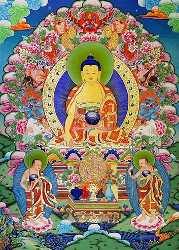

I am Odin Zhang, also known as Haotian Zhang. I established this repository to disseminate the scripts and functions I have utilized in the realm of computer-aided drug discovery. The scope of this repository is extensive, encapsulating diverse topics ranging from the computation of a molecule's electronic density and the subsequent mapping of this value to a user-specified box, to the exploration of various fragmentation strategies for structural modifications, such as linkers, fragments, scaffolds, and side-chains. You can learn more about me and my work on my [Homepage](https://haotianzhangai4science.github.io/). 

I sincerely hope that these resources will prove advantageous in your own research!

“In what manner should it be taught to others? By teaching it without attachment to form with the immutability of the absolute.

云何为人演说，不取于相，如如不动。

“Why is it?

何以故？

“Because: All phenomena are like a dream, an illusion, a bubble and ashadow, Like dew and lightning. Thus should you meditate upon them.”

一切有为法，如梦幻泡影，如露亦如电，应作如是观。

When the Buddha had finished expoundingthis sutra,

佛说是经已，

the elder Subhuti, together with bhiksus,bhiksunis, upasakas, upasikas,

长老须菩提及诸比丘、比丘尼、优婆塞、优婆夷、

and all the worlds of devas, men and asuras who had listened to His teaching, were filled with joy and believed, received and observed it.

一切世间、天、人、阿修罗，闻佛所说，皆大欢喜，信受奉行。

