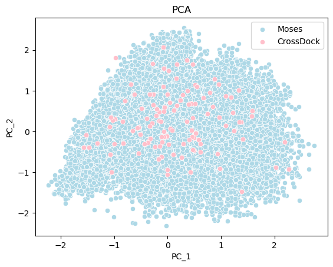
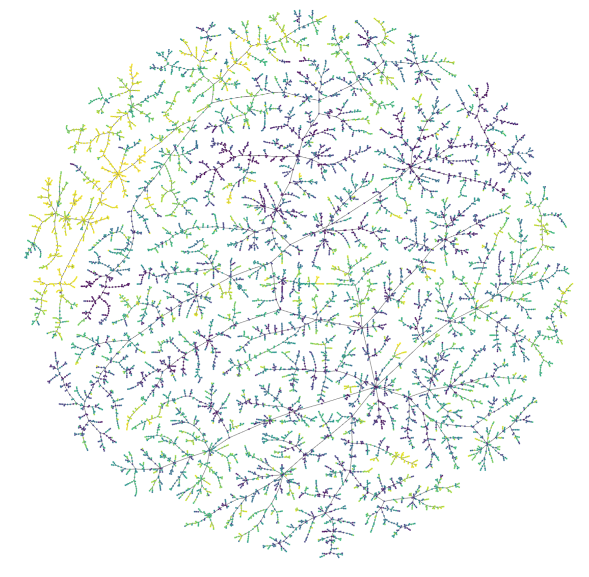

## Chemical Space

Chemical space is a non-trivial concept, and if you could find the feasible coordinates to represent this, you have already grasped a comprehensive understanding of chemical space. Thus, at this time, we know little about it, but we can exploit certain ways to serve our intentions. 

## What is Chemical Space

Chemical space can be thought of as the set of all possible molecules or materials. We generally consider more narrowly defined chemical spaces that are defined or constrained by the structures or functions of the molecules they contain.  

## How to Draw a Chemical Space

### Fingerprint and Dimension Reduction Methods

This is also called the descriptor-based space. 

See `./pca_tsne/pca_and_tsne.ipynb`

<div align=center>

</div>


### Molecular Properties and T-Map

```python
# after cd to the ./tmp
python drugbank.py
# and you can prepare your own data with 
python creat_csv_4tmap.py --smiles_txt xxx --save_file xxx
# then change the file name in drugbank.py and run it again!
```


<div align=center>

</div>

## Related work

**Mapping of the Available Chemical Space versus the Chemical Universe of Lead-Like Compounds.**

This paper reported a method to compare different large chemical libraries. Basically, they map the chemicals to heatmap. 

**Comparison of descriptor spaces for chemical compound retrieval and classification.** 

This paper describes several descriptor-based chemical spaces and tries to make comparisons between them. 

**Defining and Exploring Chemical Space. Connor W. Coley.**

This paper describes the general concepts of chemical space, proposing synthetically-aware deep generative models. 

**How Much of the Chemical Space Has Been Explored? Selecting the Right Exploration Measure for Drug Discovery**   

This paper proposes a novel framework to systematically evaluate exploration measures for drug candidate generation.  

 **Visualization of very large high-dimensional data sets as minimum spanning trees**

This paper is the mother of tree-like chemical space. Besides, it provides a famous t-map method for visualization. 

**Dimensionality reduction by UMAP to visualize physical and genetic interactions**

Uniform Manifold Approximation and Projection (UMAP)

**ChEmbVis: Visual exploration, comparison, and evaluation of chemical embeddings**

A M.S. Thesis, which deserves a comprehensive reading. 

