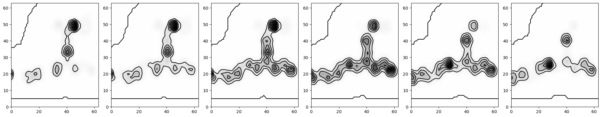

[(60条消息) [seaborn\] seaborn学习笔记3-直方图Histogramplot_seaborn histogram_落痕的寒假的博客-CSDN博客](https://blog.csdn.net/LuohenYJ/article/details/90704424)


#### hist plot

```python
# the classical histgram plot according to the given intervals 
bins = np.arange(0,110,10)
plt.hist(all_per, bins, edgecolor='black')
plt.show()
```


#### stick related 

```python
# set the stick interval as 2
from matplotlib.pyplot import MultipleLocator
x_major_locator=MultipleLocator(2)
ax.xaxis.set_major_locator(x_major_locator)

# set the stick size 
plt.xticks(fontsize=18)
plt.yticks(fontsize=18)

# set the stick range
ax.set_xlim([0,14])

# set the stick size and width
tick_size = 10
ax.tick_params(size=tick_size, width=3)
```

#### spines related 

```python
# set the color of spines as black 
for spine in ax.spines.values():
    spine.set_color('black')

# set spines invisible
ax.spines['right'].set_visible(False)
ax.spines['left'].set_visible(False)
ax.spines['top'].set_visible(False)
ax.spines['right'].set_visible(False)
# or 
for spine in ax.spines.values():
    spine.set_visible(False)
# Even if you remove the spines, but the ticks, the number, still pertain. 
ax.set_xticks([])
ax.set_yticks([])
# set line width of spines
width = 3
for spine in ax.spines.values():
    spine.set_linewidth(width)
```

#### plot related

```python
# bar plot
counts = np.bincount(prop)/len(prop)
ax.bar(range(13), counts, width=0.6, align='center', color='white', ec=sns.color_palette()[0], linewidth=2)
# width is the width of bar
# ec is the color of outline of bar
# linewidth is the the line width of bar
```

#### scatter plot

```python
# using the label to directly assign the legend belonging. 
ax.scatter(actual_values, predicted_values, label='Predicted vs Actual')
```

#### Contour Plot

```python
sns.kdeplot(moses_transformed_new[:,0], moses_transformed_new[:,1], cmap="Blues", shade=True, shade_lowest=False, ax=ax, label='Moses')
```


#### other 

```python
# delete the grid in the ax
ax.grid(False)
```


#### Cmap (coloar-map) options 

```python
'viridis': Perceptually uniform colormap, suitable for accurately representing data in heatmaps.
'plasma': Another perceptually uniform colormap, but with a more vibrant color range.
'inferno': Similar to 'plasma', but with darker low values.
'magma': A softer, less contrasty perceptually uniform colormap.
'cividis': Designed to be legible by those with color vision deficiencies.
'Greys': A grayscale colormap.
'Blues': Varying shades of blue.
'Reds': Varying shades of red.
'coolwarm': Blue to white to red transition, good for diverging data.
'seismic': Blue to white to red, another option for diverging data.
'rainbow': Covers the spectrum of colors, but not perceptually uniform.
'jet': A popular colormap but often criticized for not being perceptually uniform.
```


#### CountourPlot

```python
y_slice_indices = [10, 20, 30, 40, 50, 60]
ref_file = './1e8h/1e8h_A_rec_1e8h_adp_lig_tt_min_0_ecloudref.npy'
ecloud_ref = np.load(ref_file)[0]
# Convert the data type of the loaded 3D array to float32 for compatibility with matplotlib
data_3D_float32 = ecloud_ref.astype(np.float32)
# Create subplots for slices along the Y-axis at specified indices
fig, axes = plt.subplots(1, len(y_slice_indices), figsize=(20, 4))

# Plot the 2D slices
for ax, idx in zip(axes, y_slice_indices):
    slice_2D_y = data_3D_float32[:, idx, :]
    im = ax.imshow(slice_2D_y, cmap='magma', origin='lower')
    # ax.set_title(f'Slice along Y-axis at index {idx}')
    # ax.set_xlabel('X-axis')
    # ax.set_ylabel('Z-axis')
    for spine in ax.spines.values():
        spine.set_visible(False)
plt.tight_layout()
plt.show()
```

<div align=center>

</div>

#### Ink Style

```python
# contour draws only the contour lines while leaving the area between the lines unfilled. In contrast, contour fills the area with color maps indicating the value at it. 
x_coord, y_coord, z_coord = np.meshgrid(np.arange(64), np.arange(64), np.arange(64))
z_slice_indices = [28, 29, 30, 31, 32, 33]
ecloud_ref = np.load('1bsj_A_rec_1bsj_mln_lig_tt_min_0.npy')
ecloud_ref = ecloud_ref.astype(np.float32)
# Convert the data type of the loaded 3D array to float32 for compatibility with matplotlib
data_3D_float32 = ecloud_ref.astype(np.float32)

# Create subplots for slices along the Y-axis at specified indices
fig, axes = plt.subplots(1, len(z_slice_indices), figsize=(20, 4))

# Plot the 2D slices
for ax, idx in zip(axes, z_slice_indices):
    slice_2D_z = ecloud_ref[:, :, idx]
    x_slice = x_coord[:, :, idx]
    y_slice = y_coord[:, :, idx]
    contourf = ax.contourf(x_slice, y_slice, slice_2D_z, levels=50, cmap='Greys')
    contour = ax.contour(x_slice, y_slice, slice_2D_z, levels= [0.025, 0.1, 0.2, 0.3], colors='k')  # 'k' for black contour lines
    for spine in ax.spines.values():
        spine.set_visible(False)
    ax.set_xticks([])
    ax.set_yticks([])
# Add a colorbar
# fig.colorbar(im, ax=axes.ravel().tolist(), orientation='vertical', label='Intensity')

plt.tight_layout()
plt.show()
<div align=center>

</div
```

<div align=center>
    
</div>


