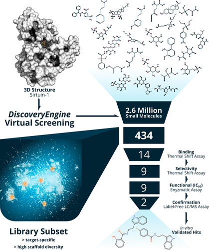
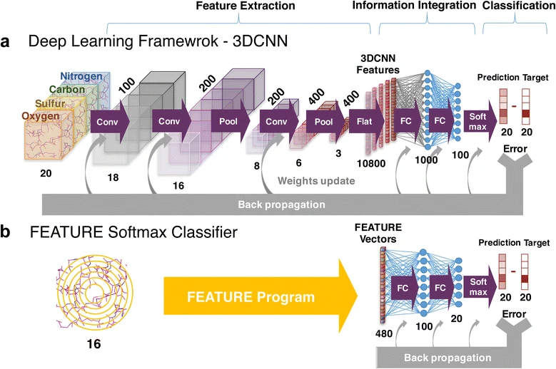

AI-Powered Virtual Screening of Large Compound Libraries Leads to the Discovery of Novel Inhibitors of Sirtuin‑1  

https://pubs.acs.org/doi/10.1021/cen-10023-cover

3D deep convolutional neural networks for amino acid environment similarity analysis  

