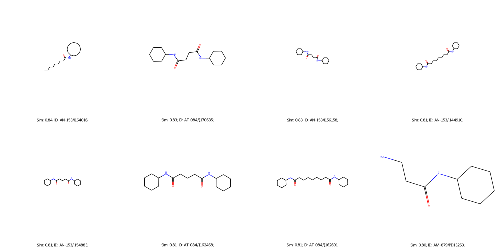
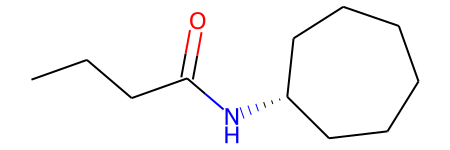
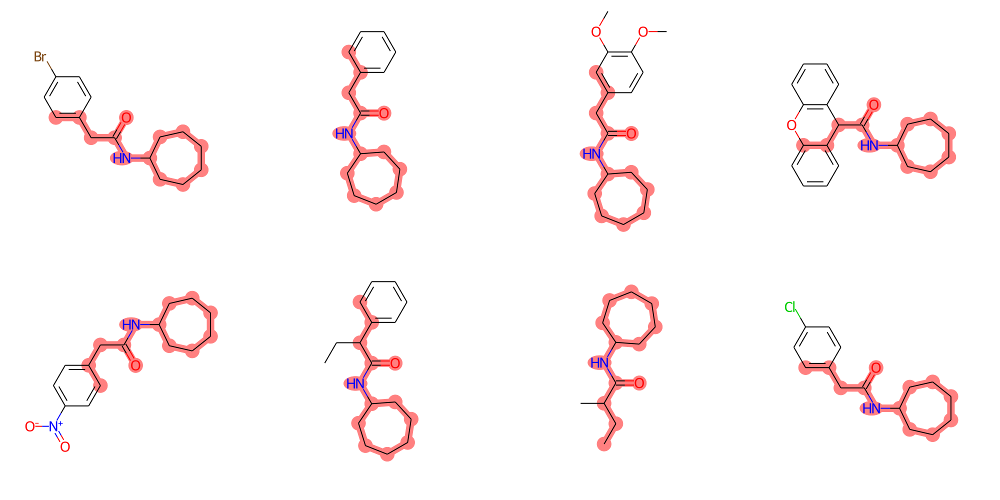
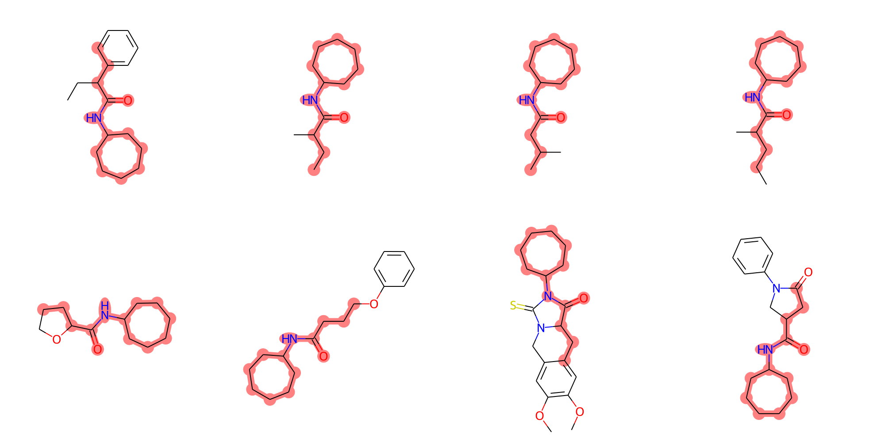
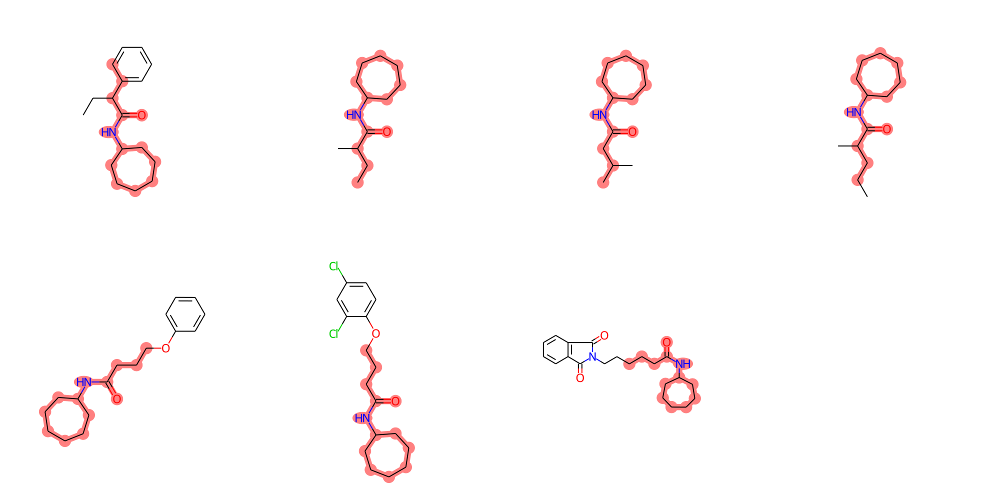

OpenEye has many useful functionality. I will provide some of my scripts to harness OpenEye in CADD. 

You can install OpenEye using conda, but to run it, you must obtain an official license. After securing the license, you should include its path in your environment variables.

```shell
export OE_LICENSE="/path/to/your/oe_license.txt"
```

### Select Chemicals from Libraries. 

For the background and ligand libraries download (.smi/.sdf), you can refer to my another repo, [delete-protocol](https://github.com/HaotianZhangAI4Science/delete-protocol). 

#### Search the Most Similar Molecules 

Our script employs commercial software, OpenEye, for fast-searching compound libraries. 

```shell
# Make fingerprints of libraries. Here we show the chemdiv example. Try other libraries based on your own needs. 
python makefastfp.py -in ./library/Specs_ExAcD_Aug_2020.sdf -fpdb ./library/Specs_ExAcD_Aug_2020.fpbin

# Once you obtain the fingerprint database (fpbin), you can search the query mol using the following script. 
python search_similarity.py --query_sdf ./frag2.sdf --molfname ./library/Specs_ExAcD_Aug_2020.sdf --fpdbfname ./library/Specs_ExAcD_Aug_2020.fpbin --saved_sdf ./case_examples/sim_searched.sdf --num_return 50
```

<div align=center>

</div>


#### Search the Molecule Containing the Query Structure

My script provides three ways to do the substructure matching: Vanilla, AddBondAliphaticConstraint, and AddBondTopologyConstraint. I have implemented the script with frag2 as the query, Specs as the library. 

The official explanation of three parameters can be found [here](https://docs.eyesopen.com/toolkits/java/oechemtk/mdlqueries.html). 

<div align=center>

</div>


```python
python search_substructure.py --query_sdf frag2.sdf --library ./library/Specs_ExAcD_Aug_2020.sdf --saved_file ./hit.sdf 
```

<div align=center>

</div>

**AddBondAliphaticConstraint**

When the `AddBondAliphaticConstraint` option is used, the substructure search algorithm imposes an additional constraint requiring that bonds in the query molecule match only aliphatic bonds in the target molecules. An aliphatic bond is a single, double, or triple bond that occurs in an aliphatic compound, which is a compound consisting of carbon and hydrogen atoms arranged in straight chains, branched chains, or non-aromatic rings. This constraint ensures that the query's bond types (regarding their aliphatic nature) must be explicitly matched in the targets, excluding aromatic bonds even if they might otherwise satisfy the query's connectivity and count requirements.

```python
python search_substructure.py --query_sdf frag2.sdf --library ./library/Specs_ExAcD_Aug_2020.sdf --saved_file ./hit.sdf --aliphatic yes
```

<div align=center>

</div>


**AddBondTopologyConstraint**

The `AddBondTopologyConstraint` option introduces a constraint on the bond topology during the substructure search. Bond topology refers to the overall connectivity and arrangement of atoms and bonds within a molecule, distinguishing between open chain (acyclic) and ring (cyclic) structures. This option ensures that the search algorithm considers the bond's presence in a ring or an open chain as part of the matching criteria. It requires that the bonds in the query molecule match bonds in the target molecules with the same topological characteristics (e.g., being part of a ring or not).

```python
python search_substructure.py --query_sdf frag2.sdf --library ./library/Specs_ExAcD_Aug_2020.sdf --saved_file ./hit.sdf --bondtop yes
```

<div align=center>

</div>

