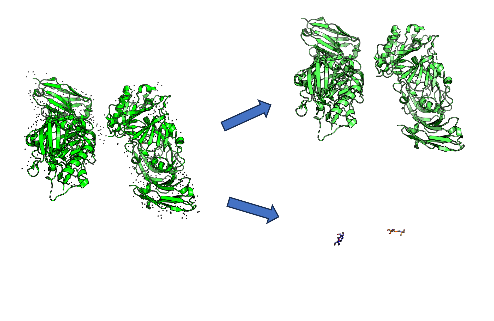

```python
conda install -c conda-forge pymol-open-source
pip install freesasa # installation from conda can not work for me. 
mamba install -c conda-forge fpocket # fpocket has no api, it can just be called by terminal. e.g. fpocket -f af_pocket.pdb
conda install mmseq2 -c bioconda
```

mmseqs compute sequence similarity example:

```python
# firstly, create mmseqs database
mmseqs createdb train.fasta train_db
mmseqs createdb test.fasta test_db
# secondly, search seqs similarity
mmseqs search test_db train_db
# finally, convert the search results into a tabular format
mmseqs convertalis test_db train_db search_result search_result.tsv
# read search_result.tsv
train_set_ids = {}  # List of unique identifiers for the train set
test_set_ids = {}  # List of unique identifiers for the test set

with open("./tmp/search_result.tsv") as f:
    for line in f:
        query, target, similarity, _,_, _, _, _, _, _, _, _ = line.strip().split("\t")
        similarity = float(similarity)
        try:
            test_set_ids[query].append(similarity)
        except:
            test_set_ids[query] = []
            test_set_ids[query].append(similarity)
```

parKVFiner is another cavity detection method.

[LBC-LNBio/parKVFinder: parKVFinder: thread-level parallel KVFinder (github.com)](https://github.com/LBC-LNBio/parKVFinder)

#### Compute the pocket of a protein cavity. 

using fpocket to detect the possible pockets. Like the provided directory, af_pocket_out. 

<div align=center>

</div>

It detects five possible sub-pockets, and the sub-pocket of interest should be the one that is closest to the crystal ligand. 

<div align=center>

</div>


```python
from pdb_utils import read_sdf, read_pocket_info
from glob import glob
pkt_files = np.sort(glob('./af_pocket_out/pockets/*.pdb'))

distance = np.zeros(len(pkt_files))
pkts_info = []
lig_center = read_sdf(ligand_sdf)[0].GetConformer().GetPositions().mean(axis=0)
for idx,pkt_file in enumerate(pkt_files):
    pkt_info = read_pocket_info(pkt_file) # read pocket info, including center, mc_volume, hull_volume
    pkts_info.append(pkt_info)
    distance[idx] = np.linalg.norm(lig_center - pkt_info[0]) # compute the distance between ligand center and pocket center
real_pocket_id = np.argmin(distance) # find the pocket with the minimum distance
real_mc_volume = pkts_info[real_pocket_id][1]
real_hull_volume = pkts_info[real_pocket_id][2]

print('Monte Carlo Volume: ', real_mc_volume)
print('Convex Hull Volumes: ', real_hull_volume)
```


```python
# Of note, for multiple possible protein pockets detected by software like cavity, you can use the get_virtual_box_center to get the smallest box that can enclose the entire protein structure. 
# for example
from pdb_utils import get_virtual_box_center
box_center1 = get_virtual_box_center('./receptor/pocket1.pdb')
```


## pdb_utils

#### pdb_to_fasta

#### read_fasta_file

#### pdb_to_fasta_parallel

#### align_and_rmsd

#### residues_saver

#### pocket_trunction

#### extract_alphafold_pocket

#### calculate_pocket_sasa

####  read_pocket_info

#### compute_convex_hull_volume

#### find_diSContact  (in disulfide.py)

#### remove_hetatom

#### find_diSContact

return the sulfide-bonded atoms

prepare the protein PDB File for upstreaming tasks. 

```python
pdbfixer protein.pdb --replace-nonstandard --add-atoms=all --add-residues
```


## alphafold_utils

#### pdb2uniprot

#### download_alphafold_prediction


## Protein-Ligand Interaction Analysis 

Protein-ligand interaction could be done as follows: 

```
python protein_ligand_interaction_analysis.py --pdb ./4rn0/4rn0_pocket10.pdb --sdf ./4rn0/test.sdf
```

<div align=center>

</div>


## Extract Ligands from the PDB File

<div align=center>

</div>

First download the PDB

```python
from Bio.PDB import PDBList
def download_pdb(pdb_id, file_format='pdb', target_path='.'):

    # Create a PDBList object
    pdbl = PDBList()
    
    # Download the PDB file
    file_path = pdbl.retrieve_pdb_file(pdb_id, pdir=target_path, file_format=file_format, overwrite=True)
    
    # Construct the new file path with the desired file name format
    new_file_path = os.path.join(target_path, f"{pdb_id.lower()}.pdb")
    
    # Rename the downloaded file to the new file path
    os.rename(file_path, new_file_path)
    
    return new_file_path
```

Second, use `pdb_lig_split` from the `extract_ligand.py` 

```python
pdb_lig_split(pdb_file='./4bel.pdb', out_dir='./extraction/')
```

See the example in `./ligand_extraction/seperate_pro_lig.ipynb`. 
