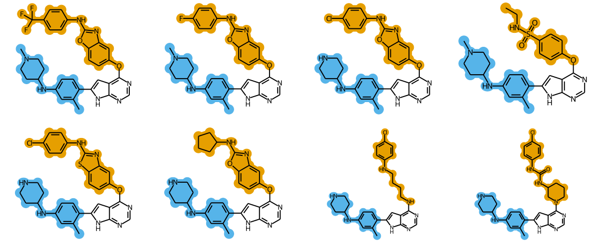
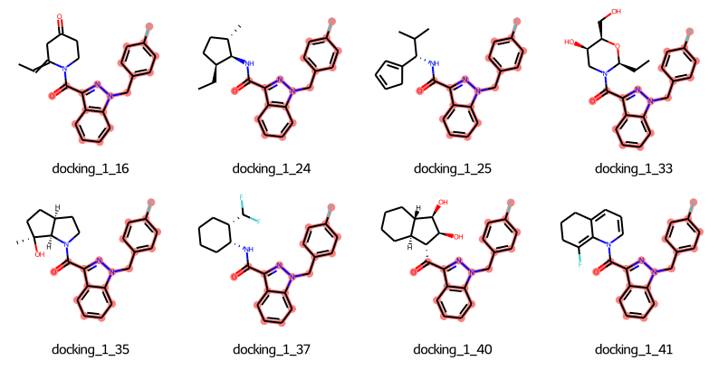
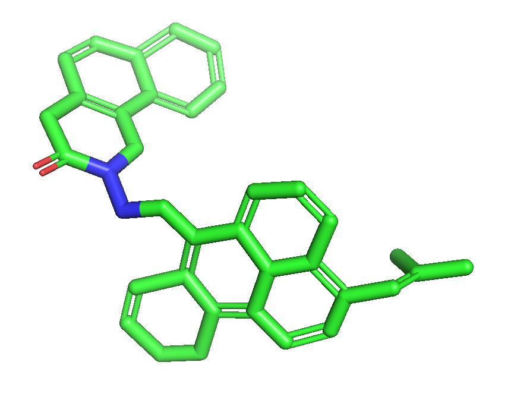
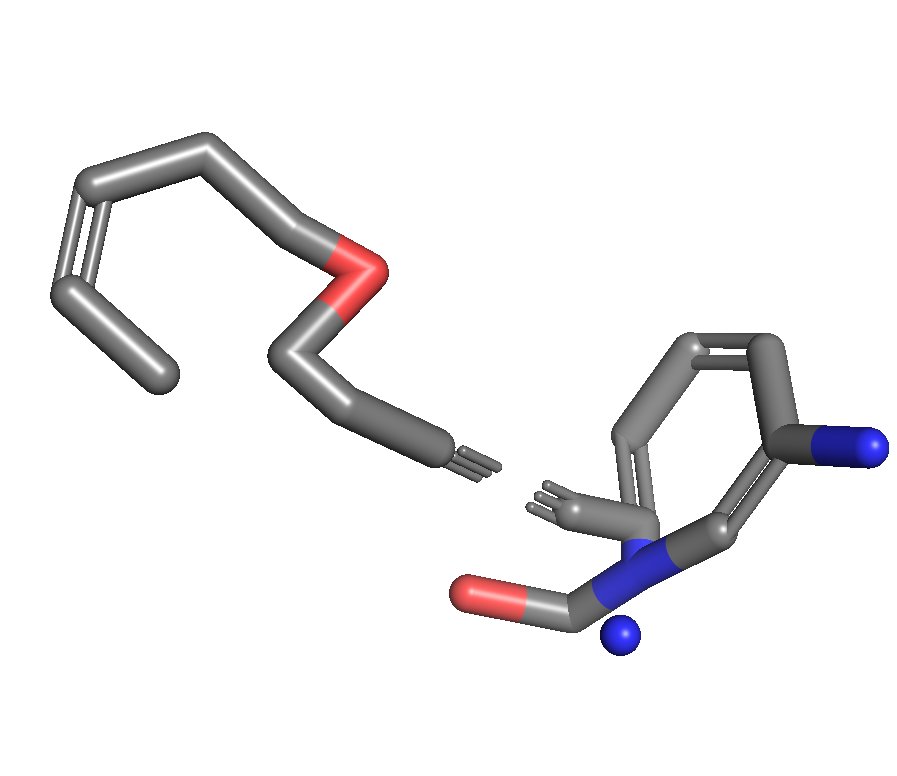
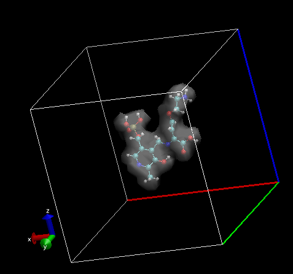
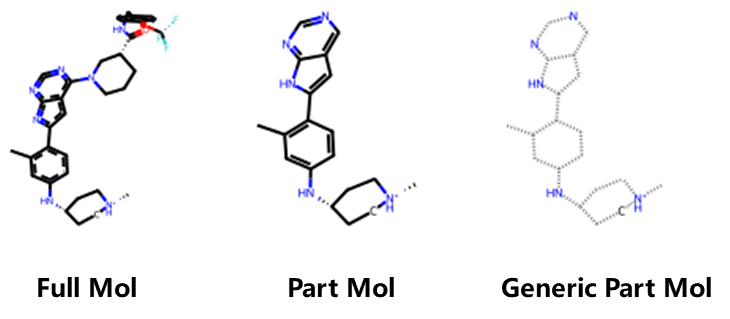
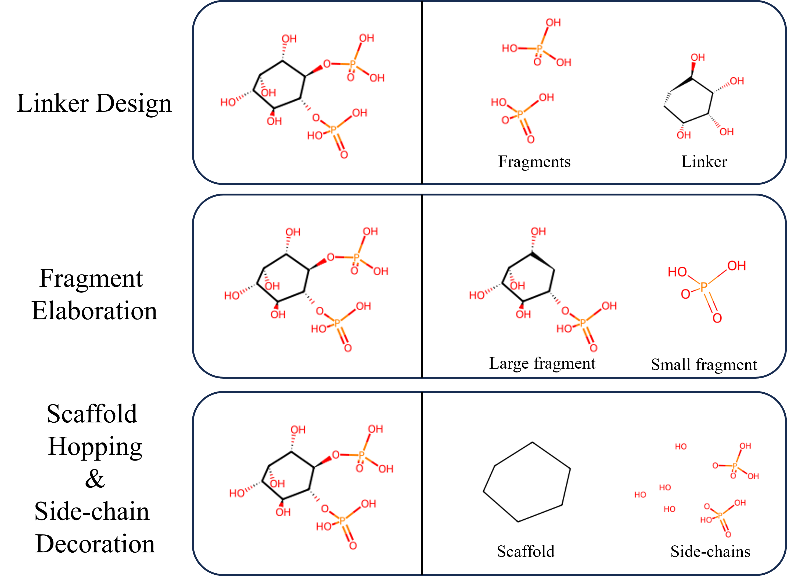
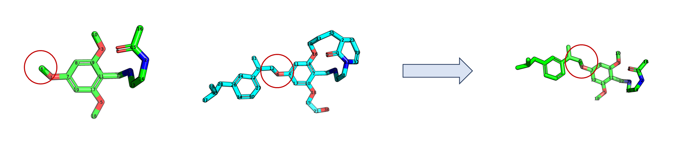

# RDKit Toolkit and Tutorial

### highlight_scaffold

Draw the picture like the following:

<div align=center>

</div>
func draw_align_mols in ./highlight_scaffold/draw_align.py

<div align=center>

</div>

### properties_computation

#### hba(mol)

#### hdb(mol)

#### tpsa(mol)

#### sasa(mol)

#### compute_sasa(pdb_file)

#### FusedRingAnalyzer(mol)

<div align=center>

</div>

Find the maximum number of fused-rings. 

#### is_molecule_fragmented

<div align=center>

</div>

Find whether the input mol is fragmented. 

### Electron Cloud (Density) 

Do you want to make the representation as follows? Please find the function in the grid_repre repo. It contains grid representation computation with htmd package and visualization file style, i.e., cube file. 

<div align=center>

</div>


```python
def mol_with_atom_index(mol):
    atoms = mol.GetNumAtoms()
    for idx in range(atoms):
        mol.GetAtomWithIdx(idx).SetProp('molAtomMapNumber', str(mol.GetAtomWithIdx(idx).GetIdx()))
    return mol

from rdkit import Chem

def mol2svg(mol, file_name):
    mc = Chem.Mol(moltoBinary())
    if not mc.GetNumConformers():
        Chem.rdDepictor.Compute2DCoords(mc)
    drawer = Chem.Draw.rdMolDraw2D.MolDraw2DSVG(300,300)
    drawer.DrawMolecule(mc)
    drawer.FinishDrawing()
    svg = drawer.GetDrawingText()
    svg_cleaned = svg.replace('svg:', '')
    with open(file_name, 'w') as f:
        f.write(str(svg_cleaned.data))
    

```

### Kekulize Error

I have discussed the possible kekulize errors you may meet in the rdkit, and almost abnormal 99% errors can be attributed to this. You can find the explanation in the `./kekulize_error`

```python
# highlight the core
if atom == 7 and all(b == 4 for b in bond_type if (bond_index[0][i] == 6 or bond_index[1][i] == 6)):
rd_atom.SetNumExplicitHs(1)
```

### Substructure Matching

The default substructure matching function in rdkit sometimes fails, especially in nitrogen-containing rings, where the issue often arises from the ring's ability to exist in different tautomeric forms or to have nitrogen atoms with different hybridization states (e.g., pyridine vs. pyrrolidine). These forms can lead to discrepancies in how a substructure search algorithm interprets the bond topology of the ring system. For example, an algorithm might not recognize a pyridine ring in a molecule as a match for a query looking for a five-membered nitrogen-containing ring if the query specifies a particular bond type or arrangement that does not account for the aromatic nature of pyridine. For instance, the following part mol is extracted from full mol using PyMol. But when loading them with rdkit, two instances share different topology, resulting in the None results of full_mol.GetSubstructure(part_mol). 


<div align=center>

</div>

Thus we introduce a generic representation of core, fostering a robust way to do the substructure mapping. After generalizing the part molecule, it will become the Generic Part Mol as shown in the above figure.  The function is in the `./substructure_matching/utils.py`. 

```python
from substructure_matching.utils import generalize, find_match

# for visual inspection
generic_mol = generalize(mol)
# an integration of generic representation in substructure matching
find_match(target, query_mols) # query_mols is considering that you may have several seperate structures to query. 
```

### Molecule Decomposition for Lead Optimization

You can use the pre-defined functions at `./lead_compound_decomposition/lead_decomp.py` for four lead optimization tasks. 

<div align=center>

</div>

```python
from lead_decomp import linker_decomp_infos, fragment_decomp_infos, scaffold_decomp_infos, side_chains_decomp_infos
ligand_nm = './1djy_A_rec_1djz_ip2_lig_tt_min_0.sdf'
mol = read_sdf(ligand_nm)[0]

linker_decomp_infos = linker_decomp(mol)
fragment_decomp_infos = fragment_decomp(mol)
scaffold_decomp_infos = scaffold_decompo(mol)
side_chains_decomp_infos = side_chains_decomp(mol)
```


### Saving Mol PNG

```python
# saving IPython.core.display.Image
from PIL import Image
import io
def save_img(ipy_Image, out_file):
    img_byte_arr = io.BytesIO(ipy_Image.data)
    img_pil = Image.open(img_byte_arr)
    img_pil.save(out_file)
    print('saved at {}'.format(out_file))
```


### Generate Conformations Using RDKIT ETKDG

```shell
python generate_confs.py --mols_sdf ./CHEMDIV_tmp/CHEMDIV_75000.sdf 
```

### Edit 3D Mol

```python
from filter.editmol_3d import read_sdf, filter_genmol_ac_attach
gen_mol = read_sdf('./fgfr3_example.sdf')[0]
frag = read_sdf('./fgfr3_frag.sdf')[0]
filtered_mol = filter_genmol_ac_attach(gen_mol, frag, [6])
```

<div align=center></div>

### Edit 2D Mol

```Python
# like chemical reaction transformation 
from rdkit.Chem import AllChem
from rdkit import Chem

def amide2amine(mol):
    # !@ represent the bond that is not in the ring
    rxn = AllChem.ReactionFromSmarts("[C:1](=O)!@[N:2]!@[CH3:3]>>[C:1](=O)[C:2]=[C:3]")
    # CH3 denotes terminal Carbon
    ps = rxn.RunReactants((mol,))
    if len(ps) == 0:
        return None
    return ps[0][0]

mol = Chem.MolFromSmiles('CNC(=O)NC1CCCC(c2nc3ccccc3n2CC(=O)NCC(C)(O)c2ccco2)C1')
edit_mol = amide2amine(mol)
```

<div align=center></div>
